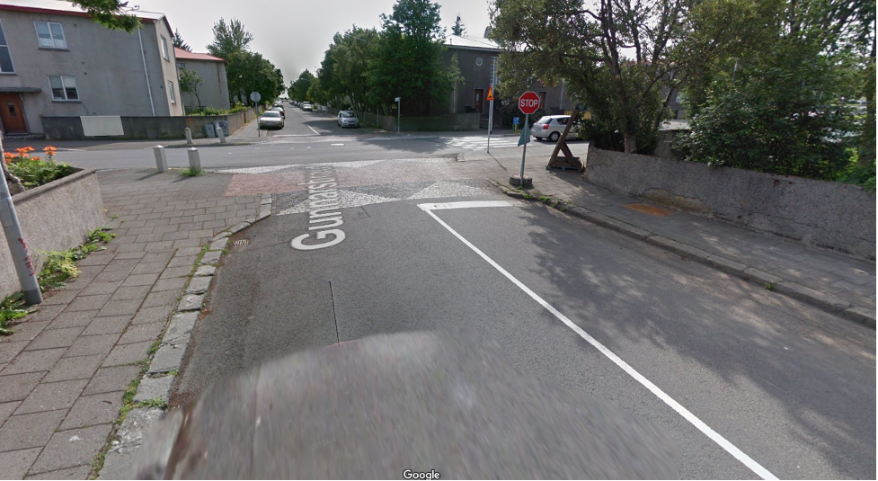
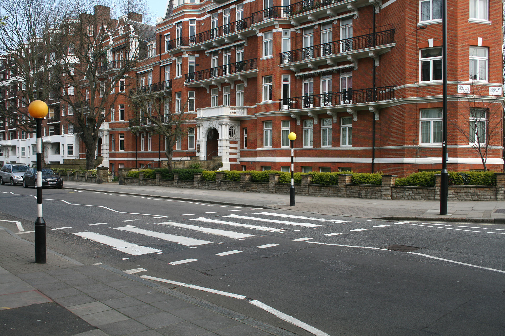

I wanted to create a running list of interesting traffic calming measures that I’ve come across when traveling was a thing

## Iceland 

In the picture below, you can see a crosswalk, and if you look closely you can see that crosswalk is raised above the ground. In the short term, drivers break to avoid being jolted out of their seats; however, the long run effects of this traffic calming measure are a little more subtle. After driving over these crosswalks several times, drivers begin to associate the visual aesthetics of the crosswalk with the need to break every time. In effect, this ensures that drivers are always ready to break at a crosswalk, which is exactly what they should be doing if a pedestrian is in fact about to cross! In my experience, not all of the crosswalks were raised. However, there were certainly enough of them to ensure that I wouldn’t want to drive over them very quickly! 

P.S. Not all of the crosswalks have stop signs in front of them, but this was the best picture I could find 

## United Kingdom

In contrast, many crosswalks (below is a “zebra” crossing in the UK) are simply paint and thus drivers often have no need to break if there isn’t a pedestrian. Essentially, placing speed bumps around crosswalks removes any uncertainty as to what action a driver needs to take when they see a crosswalk.

## South Korea

In the video below, at around the 5 second mark, you can see a yellow and white speed bump. Pay attention to how the camera shakes after going over the speed bump. At around the 18 second mark, you can see a second yellow and white speed bump, note how the camera doesn’t shake after going over the second speed bump. This is because it’s not actually a speed bump, just yellow and white paint! By pairing yellow and white with enough speed bumps, drivers learn to associate these colors with slowing down, even though not everything that is painted yellow and white is actually a speed bump.

<iframe width="560" height="315" src="https://www.youtube.com/embed/-UpO3zkKdHo" frameborder="0" allow="accelerometer; autoplay; clipboard-write; encrypted-media; gyroscope; picture-in-picture" allowfullscreen></iframe>
   
